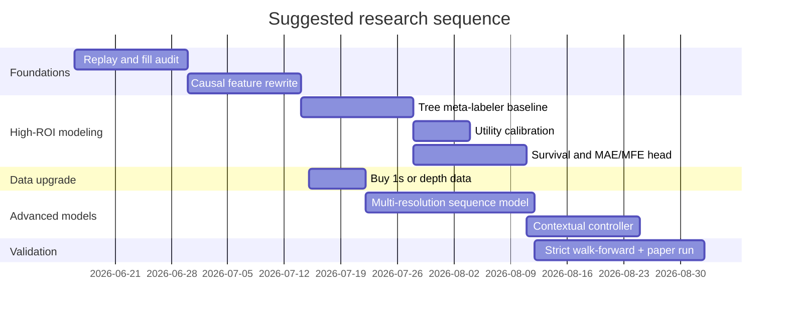

# Improving an AI-Enabled Futures Trading Bot for MNQ, MES, ES, and NQ

## Executive Summary

The highest-confidence conclusion from both your uploaded research logs and the literature is that your next improvement should **not** be “replace the bot with a giant end-to-end AI model.” The best path is a **hybrid architecture**: keep a causal rule engine for candidate setups, add a **supervised meta-label / ranking model** to decide which setups to take, add a **microstructure-aware survival or risk head** to manage early exits and stop placement, and then add a **challenge-aware policy layer** to decide sizing, daily caps, and whether to switch into a protective mode. In your setting, that is more likely to improve **pass30/pass60, max drawdown, and fill-robustness** than a raw diffusion model or a pure RL agent. This matches both your internal reports and the strongest external evidence: tree ensembles remain very hard to beat on structured tabular problems, limit-order-book models add value when you have microstructure data, and RL is most convincing for execution and continuous control rather than first-pass alpha discovery. fileciteturn0file0 fileciteturn0file5 citeturn32academia0turn38academia3turn38academia0turn29view1turn27academia3

Your own reports show the core issue clearly. The original live-style configuration was **not primarily failing because the signal had no edge**; it was failing because the strategy objective and the funded-challenge objective were misaligned. In your architect report, the live config could hit the nominal profit target in many starts, but its occasional large days broke FundedNext consistency economics, while the $450-capped control improved certification odds materially. Later research still concluded that no new strategy overlay clearly beat the control once drawdown, split-half stability, and fill realism were enforced. A later blocked validation did surface one promising hybrid family, but that result was not yet sufficiently replicated under the stricter realism checks. So the right interpretation is: you likely have **base signal value**, but your current architecture still leaks edge through **execution realism, tail losses, wrong objective functions, and unstable overlays**. fileciteturn0file0 fileciteturn0file5 fileciteturn0file7

If I compress the whole report into one line, it is this: **the most profitable and accurate ML upgrade for your bot is probably a calibrated XGBoost/LightGBM/CatBoost meta-model on top of causal setup features and microstructure features, followed by a survival-style trade-management model and a contextual risk controller.** If you buy deeper data, the best next extension is a **DeepLOB/TLOB-style multi-resolution sequence model** around entry windows. Autoregressive and diffusion models are worth pursuing later as **path simulators and uncertainty engines**, not as your first production decision-maker. citeturn32academia3turn33academia0turn38academia3turn38academia0turn39academia1turn38academia2

## What your uploaded results are actually saying

Your reports point to four practical truths.

First, the funded-challenge objective is dominating everything. In the architect lab, the problem with the live configuration was explicitly diagnosed as a **certification failure, not a signal failure**. The strategy could reach the profit goal in many starts, but its rare outsized days broke consistency economics; the simple $450 day ceiling plus adjusted risk cadence was the control that materially improved pass30 and pass60. That means your optimization target must be changed from “maximize trade expectancy” or “maximize P&L” to **maximize probability of passing the challenge under its path-dependent rules**. fileciteturn0file0

Second, fill realism is still a major unresolved gap. Your architect report showed the control doing much better under the internal engine than under the NinjaTrader-style realism bracket, where stop fills, target-through rules, and adverse exit assumptions materially reduced pass rates. The latest broader report reached a similar practical conclusion: there was still no new candidate that improved pass rate **without** creating other damage in drawdown, split-half behavior, trade density, or realism robustness. This should change your priorities: before adding “smarter AI,” you need a better estimate of what fills you actually get. fileciteturn0file0 fileciteturn0file5

Third, standalone setup overlays have not yet solved the real problem. In your own tests, the sweep/FVG and reclaim families did not produce a robust production promotion; the later deep-research report again said no research candidate improved pass rate without hurting risk or robustness. That strongly suggests your edge is currently being lost not because you lack *another entry pattern*, but because you lack **better setup ranking, better stop management, and better challenge-aware capital allocation**. fileciteturn0file0 fileciteturn0file5

Fourth, there is still one lead worth keeping alive. In the later blocked paper-validation run, a family hybrid labeled around a B60 momentum/exhaustion/session-extreme theme posted stronger paper pass metrics than the control and deserved blocked validation rather than immediate dismissal. The right response is not “deploy it,” but “port it into the stricter fill- and semantics-correct lab and see whether it survives.” It is a lead, not a winner. fileciteturn0file7 fileciteturn0file5

The implication is straightforward. What you are “doing wrong” is less about having a bad win rate and more about optimizing the wrong object. A funded challenge is a **path-constrained control problem** with daily cap, daily kill, consistency, latency, and realism. The literature now explicitly supports this framing: recent work on liquid equity index futures argues that forecast models should be calibrated against **decision loss under frictions and constraints**, not only statistical error, and reports meaningful decision-loss reduction from utility-weighted calibration under nested walk-forward testing. citeturn41academia2

## What the research says about AI and ML for futures and high-frequency trading

The strongest empirical evidence for short-horizon prediction still comes from **microstructure-aware modeling**, not from generic candle forecasting. Simple order-book statistics such as **queue imbalance** already have predictive power for the next move, and more sophisticated LOB models such as **DeepLOB** and the recent **TLOB** show that sequence models can learn robust spatial-temporal regularities from book states. Separately, Sirignano and Cont’s work argues that price formation has universal structure and that pooling data across assets can outperform purely asset-specific modeling. For your use case, this means your BBO data is genuinely valuable, but only if you feed it into a causal, execution-aware model rather than treating it as a decorative feature. citeturn37academia7turn38academia3turn38academia0turn37academia0

For structured setup selection on bar features, the literature remains very favorable to **gradient-boosted trees**. XGBoost, CatBoost, and related boosting systems are still the first baseline to beat, and modern tabular-research surveys keep finding that deep tabular models are often useful as complements or for special settings, not automatic replacements. This matters because your present data—minute bars, engineered features, setup flags, session context, distances to levels, and BBO summaries—is exactly the kind of structured tabular problem where boosted trees are often strongest. citeturn32academia3turn33academia0turn32academia0turn33academia3

There is also strong evidence that **hybrid momentum frameworks** can outperform naive hand-built trend rules in futures. Deep Momentum Networks train on futures directly and learn both trend estimation and position sizing; Dynamic Momentum Learning adapts the speed of momentum based on changing conditions; and Slow Momentum with Fast Reversion shows that inserting **changepoint detection** into a deep momentum pipeline improves response to regime shifts and turning points. Even though those papers are not one-minute Nasdaq-futures scalping papers, they are highly relevant because they show a robust design principle: **mix slow regime identification with fast local response, instead of forcing one signal family to do both jobs**. citeturn43academia3turn43academia1turn45academia2turn45academia0

Reinforcement learning is more promising for your **execution and policy layer** than for raw alpha generation. Qlib explicitly supports supervised workflows, rolling retraining, and RL for order execution, while FinRL provides a general RL toolkit for trading environments. In other words, RL is useful where the action space is continuous and sequential—size, route, hold, trim, cancel, flatten, daily budget—not where the model must discover a fragile entry edge from noisy one-minute data with scarce labeled outcomes. citeturn29view0turn29view1turn27academia3turn28view2

Autoregressive and generative models do belong in your research stack, but not as the first production layer. **DeepAR** is a useful template for probabilistic autoregressive forecasting across related series. Recent work like **SimLOB** and **DeRegiME** suggests strong value in latent-state learning, probabilistic forecasting, and regime-mixture modeling under nonstationarity. That is important, but it points more toward **scenario simulation, uncertainty quantification, and regime tagging** than toward a one-shot buy/sell oracle. For your bot, that makes these models attractive as downstream **path samplers and uncertainty engines** rather than first-line trade selectors. citeturn39academia1turn38academia2turn39academia3

Finally, nonstationarity is not optional background noise in finance; it is central. Bayesian online changepoint detection and its newer autoregressive extensions are directly relevant to intraday futures trading because they let you detect when the local data-generating process shifts. The best future version of your bot should almost certainly contain an explicit **regime gate**. citeturn31academia0turn31academia1turn45academia2

## The model stack most likely to improve this bot

The most practical architecture for your data and challenge format is a **four-layer stack**.

### Candidate generator

Keep a **small family of causal rule-based entries** rather than one grand unified strategy. In your setting, the most sensible families are: a trend-continuation family, a local-reversal/liquidity-shock family, an opening-range or anchored-VWAP family, and one SMC-style liquidity-vacuum/FVG family. The goal is not to let rules decide everything; the goal is to give ML **high-quality candidates** rather than asking it to discover trades in the entire bar stream from scratch. That design is consistent with hybrid momentum literature and with your own reports, which suggest the control engine already contains base signal value. fileciteturn0file0 citeturn43academia3turn45academia2

### Setup quality model

The first ML model should be a **tree-ensemble meta-labeler/ranker**. Use XGBoost, LightGBM, or CatBoost as the production baseline. Its job is to answer, for every candidate setup, questions like: *What is the probability this trade reaches target before stop? What is the expected net PnL after slippage? What is the chance this becomes a left-tail loser? Which trades belong in the top decile today?* This is the layer with the highest probability of near-term profit improvement. citeturn32academia3turn33academia0turn32academia0

The feature set for this model should combine:
- minute-bar structure from multiple frames such as 1m, 5m, 15m, and 60m;
- causal level distances, such as prior day high/low, opening range, VWAP or anchored VWAP, overnight extremes, session midpoint, and volatility-normalized distances;
- microstructure summaries from BBO, such as spread, microprice, queue imbalance, queue imbalance slope, quote refill velocity, bid/ask size asymmetry, and short-horizon pressure changes;
- causal SMC-derived flags, such as FVG existence, reclaimed imbalance, sweep-at-level, displacement bar state, and order-block context, but **only after rewriting every indicator to be strictly causal**;
- regime variables such as realized volatility bucket, time-of-day, day-of-week, gap type, and higher-timeframe bias. citeturn37academia7turn37academia0turn40academia0turn40academia1

### Trade-management model

The second ML model should **not** predict direction. It should predict **path risk** after entry. This is where recent fill-probability and survival-analysis work is useful. Build a survival or hazard-style model that estimates:
- probability stop gets hit before target,
- expected maximum adverse excursion over the first 30, 60, 120, and 300 seconds,
- probability of favorable move stalling,
- probability a limit exit will actually fill under your queue assumptions.  

This is the cleanest way to attack your present risk-management weakness. A lot of bots are decent at finding “okay entries” and terrible at managing the first minute after entry, which is exactly where funded-challenge left tails appear. citeturn38academia1turn28view0

### Policy controller

On top of those models, add a **contextual controller** that decides sizing, allowed trade count, daily mode, and whether to hard-cap the day. This can begin as a contextual bandit and later become offline RL. The reward should be **challenge-aware**, not raw trade PnL. Use a utility that penalizes daily kill events, consistency breaches, oversized best-day effects, and adverse slippage. That recommendation is strongly reinforced by the recent futures paper on utility-weighted forecasting under trading frictions. citeturn41academia2turn29view1

### Comparative view of model classes

| Model class | Best use in your stack | Data need | Compute need | Near-term expected benefit | Main risk |
|---|---|---:|---:|---|---|
| XGBoost / LightGBM / CatBoost | Setup ranking and meta-labeling | Low to medium | Low | **Very high** | Good scores but poor utility if labels are wrong |
| DeepLOB / TLOB-style sequence model | Entry-window quality and microstructure timing | Medium to high | Medium to high | High after data upgrade | Needs richer book data and careful replay |
| LSTM / TCN / transformer on bars | Multi-frame bias and regime context | Medium | Medium | Medium | Easy to overfit one-minute noise |
| Autoregressive model | Probabilistic path forecasts | Medium | Medium | Medium | Forecast skill may not convert to trading skill |
| Diffusion / generative model | Scenario generation, stress testing, path sampling | High | High | Medium later | Research risk; weak direct live evidence |
| PPO / SAC / offline RL | Sizing, execution, daily policy | Medium to high | Medium to high | Medium to high | Reward design and simulator mismatch |
| GNN | Cross-asset relation modeling | Higher universe needed | Medium | Low for your current four-contract universe | Too little graph structure |
| Change-point / anomaly detection | Regime gating and mode switching | Low to medium | Low | High | Can over-trigger without calibration |
| TabPFN | Rapid small/medium tabular benchmark and ensembling | Low to medium | Medium | Medium | Licensing and production constraints |

The key point is simple: **if you build only one model next, make it the tree-based meta-labeler.** If you build two, add the survival/risk head. If you buy better data, then add the sequence model. RL and diffusion come after that. citeturn32academia0turn38academia3turn38academia1turn41academia2

## How to tailor training and labeling to your data

Your present labels should stop being “up/down over N bars” and start being **execution-aware event labels**.

The best primary label for your current bot architecture is a **first-touch label**: did the trade hit target, stop, or a time barrier first, under your actual fill rules? That directly aligns the model with trade decisions. A second label should be **net realized trade utility** after slippage and challenge penalties. A third should be **early-path MAE/MFE** so you can learn stop tightening, soft exits, or do-not-enter decisions. This is exactly where denoised labels, contrastive learning, and utility-weighted calibration become relevant: finance labels are noisy, and you want labels that reflect decision value rather than raw return sign. citeturn40academia0turn40academia1turn41academia2

For losses, use a combination of:
- log loss or focal loss for hit/stop classification,
- quantile loss for future MAE/MFE or return distribution,
- Brier or calibration-oriented loss for probability reliability,
- an asymmetric utility loss that penalizes overconfident left-tail decisions,
- and, at the policy-controller level, a challenge-aware utility function.  

The important part is that your training objective should “feel” the real pain points: daily kill, consistency failure, stop slippage, and low-quality trades during noisy regimes. Recent work on risk-aware RL rewards and utility-weighted forecasting under frictions supports exactly this kind of objective redesign. citeturn41academia1turn41academia2

For validation, use a **nested walk-forward protocol** with purging around adjacent events and no event overlap leakage. Your reports already show how fragile results can be when realism changes. So every candidate should be evaluated in at least three layers: internal engine, stricter fill realism, and paper/live-forward holdout. Do not advance anything just because it improves AUC or even per-trade expectancy. Advance it only if it improves **pass30/pass60 or materially reduces drawdown without sacrificing promotion robustness**. fileciteturn0file0 fileciteturn0file5 citeturn41academia2turn28view0

## Strategy improvements that are likely better than adding a fancy model first

Your reports suggest that **entry discovery is not the only bottleneck**. Some rule changes are probably higher ROI than a new architecture.

The first is to separate **entry selection** from **trade management**. Right now, the research evidence and your own results both suggest that the system can still produce decent base setups, but then loses value through path-wise tail behavior. That calls for a dedicated early-excursion model and dynamic stop logic, not just another setup family. fileciteturn0file5 citeturn38academia1turn41academia2

The second is to think in terms of **trend-day versus shock-reversion mode** rather than one blended strategy. The best academic momentum work in futures now explicitly benefits from changepoint modules that allow the system to carry slow momentum in stable regimes and switch rapidly when the regime turns. In intraday index futures, that maps naturally to two modes: a continuation mode and a mean-reverting shock mode. citeturn45academia2turn43academia1turn43academia3

The third is to use your SMC/ICT concepts as **features, not doctrines**. FVG, order block, failed sweep, and multi-timeframe bias can absolutely be useful, but they should enter the model as engineered descriptors that compete with other features. They should not be treated as guaranteed signal truths. In practice, the most useful conversion is: represent “liquidity sweep,” “imbalance reclaimed,” “displacement confirmed,” and “HTF bias aligned” as causal binary/numeric features, then let the ranker learn when they matter and when they do not. That will also protect you from narrative overfitting. citeturn32academia0turn40academia0turn40academia1

The fourth is to add a stronger **microstructure mean-reversion family** around local shocks rather than another generic breakout family. Queue imbalance has predictive value; more recent push-response work in high-frequency S&P data suggests that large local shocks can create asymmetrical conditional responses. This is a better match to the “failed sweep then reclaim” intuition than a pure candle-pattern implementation, because it lets you require actual pressure relief in the book instead of only chart geometry. citeturn37academia7turn44academia0

The fifth is to make the bot **challenge-native**. You already discovered that the $450 cap and the $200 kill variant each solve different problems. The next logical move is not to choose one forever, but to train a controller that switches between aggressive and conservative daily policy based on context. For example, after an early gain, after a volatility shock, after two low-quality signals, or on days where the survival head says stop-out hazard is abnormally high, the bot should automatically move into the protective policy. That will likely improve pass60 even before it improves raw alpha. fileciteturn0file0 citeturn41academia2turn29view1

## Repository assessment and integration feasibility

I could only verify one of the four user-provided handles unambiguously in public sources available here. For the other three names—**profittown-sniper-smc, ChartNagari, and STAR-EA**—I was not able to resolve a single verified public repository with enough confidence to score code quality honestly, so I do **not** recommend treating them as production dependencies until they are vendored and audited locally.

For the verified and high-utility public projects, the picture is clearer.

| Repo or project | Best use | Main caution | Integration verdict |
|---|---|---|---|
| joshyattridge smart-money-concepts | Rapid feature prototyping for SMC-style concepts | Audit every indicator for strict causality before live use | Useful as a prototype source, not a production dependency |
| hftbacktest | Fill realism, queue modeling, latency simulation | Originally oriented to HFT/market-making style replay; adaptation needed for futures bot | **Strong yes** for research infrastructure |
| Microsoft Qlib | Research orchestration, rolling retraining, execution/RL workflows | Equity-oriented defaults; you must build your futures dataset and challenge metrics yourself | **Strong yes** for research platform |
| FinRL | RL experimentation and policy prototyping | Simulator mismatch risk is high if you do not build realistic fills and constraints | Good for controller research, not first-line alpha |
| mlfinlab | Methodology reference for labeling, CV, bet sizing, overfitting checks | Public repo is public-facing and all-rights-reserved, so it is not a drop-in open-source dependency | Use as methodology reference, not dependency default |
| TabPFN | Very fast benchmark for setup-quality tasks on small/medium tabular datasets | Recent default weights have non-commercial constraints; GPU is recommended | Excellent benchmark/ensemble candidate |

The strongest “buy now” infrastructure repo is **hftbacktest**, because it directly addresses the exact gap your reports exposed: queue position, latency, and realistic fills. The strongest research platform is **Qlib**, because it already supports supervised learning, rolling retraining, and RL for execution/order control. **FinRL** is a good sandbox for control policies, but only after your simulator is realistic. **mlfinlab** remains useful conceptually, but the public repo is explicitly public-facing and all-rights-reserved, so do not assume it is a frictionless production dependency. **TabPFN** is worth adding as a fast benchmark or ensemble layer for your setup-ranking tasks, but watch the licensing of recent weights if commercial or production use matters. citeturn28view0turn29view0turn29view1turn27academia3turn28view2turn30view0turn35view0turn36academia1

## Prioritized experimental roadmap

The experiments below are ordered by expected return on research time.

| Experiment | What changes | Data needed | Compute | Decision gate |
|---|---|---|---|---|
| Causal feature rewrite and replay audit | Rewrite all SMC/ICT features causally; align fills and session rules | Current data | Low | No leakage, stable metrics under stricter replay |
| Tree-based meta-labeler | Rank existing setups with challenge-aware labels | Current data | Low | Improves pass30/pass60 or reduces DD without realism collapse |
| Survival / early-excursion model | Predict left-tail stop hazard and early exits | Best with 1s or finer post-entry windows | Medium | Shrinks MAE tail and improves net expectancy after costs |
| Multi-resolution sequence model | Add DeepLOB/TLOB-like entry-quality model around setup window | 1s/LOB or richer BBO | Medium to high | Beats tree baseline in top-decile precision and realism-adjusted PnL |
| Contextual policy controller | Choose size, cap, kill, trade count, mode | Current data plus prior model outputs | Medium | Improves certification metrics, not just per-trade stats |
| Generative scenario model | Sample path distributions for stress testing and robust sizing | More years + deeper book data | High | Useful only if it improves decision utility, not forecast elegance |

In practical terms, your next 8–12 weeks should look like this:

The most important decision gates are these. A candidate advances only if it improves **challenge-level metrics** under the corrected semantics and does not blow up under stricter fill realism. You should report at least: pass30, pass60, max drawdown, consistency violations, trade count per day, expectancy, profit factor, MAE/MFE quantiles, Brier score or calibration error for probabilities, and split-half robustness. Your latest reports already show why this discipline matters: paper winners can disappear once one realism assumption changes. fileciteturn0file0 fileciteturn0file5 citeturn41academia2turn28view0

If you are willing to buy more data, the best spend is probably **not** exotic alt-data first. It is more likely to be:
- more years of **ES/NQ one-minute data** to increase regime diversity,
- **one-second or event-time data around entries and exits**,
- and, ideally, **Level-2/Market-By-Price or Market-By-Order** data for replay and fill estimation.  

That recommendation follows directly from both your file evidence and the literature on queue-aware execution. More realistic data should pay off earlier than a second GPU. fileciteturn0file5 citeturn28view0turn38academia1turn37academia7

The visualizations most worth building are a **pass30 versus max-DD frontier**, a **calibration plot** for the meta-labeler, **MAE/MFE heatmaps** by setup family and time of day, a **fill-sensitivity waterfall** comparing optimistic and strict replay, and a **trade PnL violin plot** split by regime and setup family. Those charts will tell you much faster than a single equity curve whether the model is truly solving your problem. citeturn41academia2turn28view0

## Open questions and limitations

Some parts of the evidence are still incomplete. I could not confidently resolve three of the four user-provided repo names to verified public repositories, so I did not score them. Your stronger-looking hybrid candidate from the later blocked validation remains a **lead**, not a production win, because the broader report still concluded that no new strategy had clearly survived the realism and robustness gates. And without richer post-entry data—ideally one-second and depth/queue data—your next-generation execution and survival models will remain approximations rather than true queue-aware estimators. fileciteturn0file5 fileciteturn0file7

The final recommendation remains high confidence: **build a causal hybrid system, not an end-to-end black box.** Start with a tree-based setup ranker, add a survival/risk head, then add a challenge-aware controller. Buy better fill and microstructure data before you spend heavily on large generative models. And treat SMC/ICT ideas as engineered features to be tested, filtered, and calibrated—not as assumptions the model must obey. citeturn32academia0turn38academia1turn41academia2turn28view0