# Deep Research Report on Improving Your Futures Trading Bot

## Executive summary

Your uploaded research artifacts point to a clear conclusion: the next improvement should **not** be a wholesale replacement of your current system with a pure end-to-end AI trader. The strongest path is a **hybrid architecture** that keeps the working C_CEIL/B60 control as the research benchmark, then adds three ML layers around it: **a challenge-aware event ranker, a regime gate, and a fill/survival model**. That recommendation follows both from your own results and from the recent literature. Your control is still the best repeatedly-audited strategy in the uploaded reports, with 88 trades over 60 active days, 81.8% trade win rate, corrected pass30 of 30.8%, corrected pass60 of 56.4%, and zero busts in the audited starts; but it is also a fragile high-hit-rate system with average losses far larger than average wins, strong start-month sensitivity, and a large gap between “engine” and stricter NinjaTrader-style fill assumptions. fileciteturn0file2 fileciteturn0file3

The dominant bottlenecks are **objective mismatch** and **execution realism**, not a lack of exotic model families. Your own labs already show that offline classifier quality does not automatically convert into better challenge outcomes. In the AI/SMC lab, the top offline models reached OOF AUCs around 0.68–0.76, yet most AI-gated variants failed to improve pass30 because they reduced density, selected too few days, or optimized the wrong target. In the GPT-2 follow-up lab, fast-target and transaction heads looked materially better than general “win” or “utility” heads, which suggests the tractable part of the problem is **path shape and execution quality**, not a monolithic “will this trade make money?” label. fileciteturn0file1 fileciteturn0file0

Recent research supports that diagnosis. The best-supported ideas over the last five years are: **depth- and order-flow-aware sequence models**, **direct risk-aware or Sharpe-aware objectives**, **uncertainty-aware sizing**, **survival models for fills**, **regime adaptation**, and **realistic simulators/world models** for reinforcement learning. Transformers, diffusion models, and autoregressive generative models are useful, but their best role in your setting is mostly **as feature learners, denoisers, probabilistic forecasters, or scenario generators**, not as a first live production decision engine trained directly on two years of 1-minute bars plus top-of-book aggregates. citeturn1academia0turn1academia1turn2academia0turn6academia0turn20academia2turn21academia2turn32academia3

The practical answer to “what is the most profitable / successful / accurate ML way for my bot?” is therefore:

| Topic | Bottom line |
|---|---|
| Most promising near-term ML path | **Supervised multitask event ranking** with challenge-aware utility labels, regime gating, and execution/fill survival heads |
| Highest-upside medium-term path | **Dual-tower sequence model** using multi-horizon bars plus **depth-aware BBO/LOB inputs**, ideally with MBP-10 or MBO data |
| Best use of ICT/SMT features | Use them as **causal soft features and event tokens**, not as hard gates |
| Best use of RL | **Day-level or execution-level constrained policy**, after you build a realistic simulator and capture paper/live fills |
| Best use of autoregressive and diffusion models | **World models, denoising, augmentation, and stress testing**, not the first live signal engine |
| Best data purchase | **Depth data and paper/live fill telemetry**, then more history |

These recommendations are consistent with your uploaded results and the broader literature on futures, intraday trading, and order-book modeling. fileciteturn0file0 fileciteturn0file1 fileciteturn0file2 fileciteturn0file3 citeturn5academia2turn5academia3turn20academia2turn23academia0turn25academia0

## What your artifacts reveal

The control strategy in your handoff remains economically interesting but statistically fragile. The uploaded handoff report shows 88 B60-confirmed trades over 60 active trading days, engine expectancy of +$17.06/trade/contract, conservative 1-second expectancy of +$10.35/trade/contract, corrected pass30 of 30.8%, corrected pass60 of 56.4%, max challenge drawdown of $732.04, and a visible dependence on B60 confirmation because the raw unconfirmed stack was negative in 2026. It also shows strong start-month sensitivity: 2026-01 was strong, while 2026-03 produced 0% pass30 and 0% pass60 in that replay. fileciteturn0file2

The payoff profile is the biggest structural warning. Your control wins often, but the losses are much larger than the wins: average win about +$52.42 versus average loss about -$142.07, so the loss size is roughly 2.71 times the win size, and the break-even win rate is about 73.0%. With the observed 81.8% win rate, the cushion is only about 8.8 percentage points. That is enough to work in a favorable regime, but it is not a lot of room for slippage, latency, or regime decay. This also explains why some variants can look cosmetically strong on win rate yet still be economically weak. fileciteturn0file2 citeturn35calculator0turn35calculator1turn37calculator0

Your own setup breakdown makes that point very clearly. In the current ledger, `base` is economically meaningful at 61.5% WR and about +$32.31 average PnL per trade, while `daily_filler` wins 93.8% of the time yet loses money on average, and `highwr_mes` wins 88.4% of the time but contributes only about +$1.70 per trade. In other words, some of your “filler” and “high-WR” subfamilies are more like **consistency shapers** than genuine alpha engines. That is exactly why future ML targets should be **challenge-contribution utility** and **path hazard**, not plain win rate. fileciteturn0file2

The account-geometry diagnosis in your architect lab is also important. The live-style conservative configuration failed not because the signal could never make money, but because it could not certify under corrected FundedNext semantics: larger single days raised the effective target while the slow risk budget could not close the distance within the allowed time. Your own architect report explicitly identifies this as a **certification failure rather than a signal failure**, and the corrected fix was the $450 cap plus larger risk budget and trade cadence. That means any future ML policy must optimize **probability of certification under account constraints**, not just raw PnL or Sharpe. fileciteturn0file3

Execution realism is the second major bottleneck. In the architect lab, a stricter NinjaTrader-style fill model with adverse stop fills, trade-through required for targets, and adverse market/EOD exits dropped the control from 30.8% pass30 / 56.4% pass60 to 10.3% / 12.8%. That gap is larger than the edge difference between many AI candidates. Put differently: **better fill modeling is currently more likely to change your real outcome than a new classifier family**. fileciteturn0file3

Your research pipeline already has some good anti-leakage discipline. The AI/SMC lab reports chronological testing and a five-day embargo, and the GPT-2 follow-up explicitly says future path outcomes are labels only, not features. That is good. But there are still two major remaining leakage risks. First, hard ICT/SMT features such as FVG, order block, sweep, reclaim, or CISD can leak if they are defined with future candle confirmation or post-hoc zone selection. Second, training only on already-selected B60 ledger trades creates **conditional-selection bias**: the model learns the behavior of the existing stack, not necessarily incremental edge over it. The literature is increasingly blunt that poor target design can bake past information into the task, and that cost-aware labels often shrink apparent predictability. fileciteturn0file0 fileciteturn0file1 citeturn2academia0turn2academia3turn19academia0

That same mismatch appears in your AI overlay results. The deep research AI/SMC lab reports strong-looking offline diagnostics for several feature sets, and the GPT-2 follow-up gets fast-target AUCs around 0.80 and transaction-completion around 0.70+, while stop-hazard and utility stay much weaker. Yet the corresponding strategy variants rarely improved the corrected challenge metrics. This is a classic sign that the model is learning **something predictive**, but not the thing that actually matters for your deployment objective. fileciteturn0file0 fileciteturn0file1

The contradictions across your own reports are themselves informative. The GPT-2 follow-up promoted `hybrid_b60_family_momentum_exhaustion_session_extreme` to blocked paper validation, with pass30 35.9%, pass60 76.9%, zero busts, and acceptable density in that lab. But the later deep research AI/SMC lab and the handoff report still kept C_CEIL/B60 as the research control and did not promote a new production candidate. That does not mean the GPT-2 hybrid is useless. It means the selection is **unstable across candidate universes, replay assumptions, or robustness filters**, so it deserves re-testing under stricter realism and longer data before any production change. fileciteturn0file0 fileciteturn0file1 fileciteturn0file2

The table below summarizes the main failure modes visible in the uploaded artifacts.

| Failure mode | What the artifacts show | Why it matters |
|---|---|---|
| Objective mismatch | Conservative live config can touch the raw target yet still go 0/39 certified under corrected semantics because of consistency-rule geometry. fileciteturn0file3 | Optimize pass probability under account rules, not raw PnL alone |
| Win-rate illusion | `daily_filler` has 93.8% WR yet negative average PnL; `highwr_mes` has 88.4% WR yet tiny economic value. fileciteturn0file2 | High WR is not enough; model targets must reflect utility and tail loss |
| Fragile expectancy | Avg loss is roughly 2.71x avg win; break-even WR is about 73.0%. fileciteturn0file2 citeturn35calculator0turn37calculator0 | Small deterioration in hit rate or fills can kill edge |
| Execution realism gap | NT-style replay cuts control pass30/pass60 to 10.3%/12.8%. fileciteturn0file3 | Fill modeling is a first-order research priority |
| Regime instability | Start-month sensitivity is extreme, and the raw unconfirmed stack is negative in 2026. fileciteturn0file2 | Add regime detection and more history |
| Gating starvation | Strict MTF/SMC filters and many AI overlays improve optics but reduce density or pass30. fileciteturn0file1 fileciteturn0file2 | Use these signals as soft features, not hard vetoes |
| Overlapping-path optimism | Your own handoff already warns that day-shuffle Monte Carlo is upper-bound context, not forward proof. fileciteturn0file2 | Prefer regime-aware block bootstrap and paired replay significance |
| Late-session mismatch | 16:30/16:50 concepts were not implementable under current flat-by rules and data coverage. fileciteturn0file3 | Session-aware research must respect actual firm and data constraints |

The next chart compares the control with a few of the strongest challengers from your architect, GPT-2 follow-up, and AI/SMC labs. It shows why “better” is not a single-number concept in your setup: some variants improve pass30 or pass60, but often by worsening drawdown, density, or realism. fileciteturn0file0 fileciteturn0file1 fileciteturn0file3


The offline classifier picture is similar. The next chart, built from your uploaded model diagnostics, shows that several offline models do achieve respectable OOF AUCs; but your reports also show that these gains rarely translated into challenge-level improvements. That is why future model selection should be driven by **paired challenge replay**, not by AUC, F1, or top-decile precision alone. fileciteturn0file1 citeturn2academia3


## What recent research says

The strongest research signal for your use case is not “buy the newest architecture.” It is: **use richer market-state inputs, use better labels, and evaluate under realistic execution**. Foundational microstructure work shows that price formation has long memory and cross-instrument transfer structure, while later work shows that depth, order-flow imbalance, and path dependence matter more than price-only snapshots. DeepLOB showed that CNN+LSTM architectures can extract transferable order-book features, Sirignano and Cont showed that pooled training across instruments can reveal stable price-formation structure, and later studies such as MLOFI and meso-scale LOB work found that deeper order-flow information often beats top-of-book-only summaries. More recent LOB papers also warn that apparent predictability falls materially once spread/cost-aware labels are used. citeturn1academia0turn1academia1turn32academia0turn32academia2turn2academia0turn2academia3

For futures specifically, the literature is encouraging but nuanced. Deep Momentum Networks learned trend estimation and position sizing directly by optimizing a Sharpe-like objective on large futures universes, and the 2026 large-scale benchmark on futures found that **hybrid temporal architectures** such as VSN+LSTM, VSN+xLSTM, and LSTM+PatchTST generally outperformed simpler linear baselines and many generic deep models on risk-adjusted performance. That is highly relevant for your case because it suggests that the best practical futures models are often **hybrids with explicit temporal structure and variable selection**, not necessarily giant end-to-end transformers. citeturn6academia0turn20academia2

Reinforcement learning is real, but it is not magic. There are good futures and intraday RL papers: DeepScalper shows promising results on six financial futures with risk-aware intraday RL, and Zhang–Zohren–Roberts report better-than-classical time-series momentum on 50 liquid futures with DRL. But the same literature also emphasizes the difficulty of realistic environments, frictions, and overfitting. FinRL-Meta explicitly lists low signal-to-noise ratio, bias, and overfitting as central problems in financial RL, while more recent execution papers rely on detailed simulators rather than raw historical replay alone. For your setup, RL is strongest as **a constrained policy layer for sizing or execution**, not as the first directional alpha engine trained directly from two years of bars. citeturn5academia2turn5academia3turn33academia1turn23academia3

Autoregressive and diffusion models are also promising, but mainly for **world modeling, denoising, augmentation, and probabilistic forecasting**. TimeGrad and Diffusion-TS show that diffusion-style models can do strong multivariate probabilistic forecasting and generation. Wang and Ventre show that diffusion denoising can improve downstream return classification and lower turnover, while Nagy et al. build an autoregressive message-flow model for the limit order book that can serve as a realistic “world model” for simulation and forecasting. In your setting, that points to a practical hierarchy: first use these models to improve labels, stress tests, and simulator realism; only later ask them to drive live entries. citeturn21academia2turn21academia1turn0academia1turn32academia3

Fill modeling deserves much more attention than most trading bots give it. Recent work on deep survival analysis for LOB fills shows that time-to-fill can be learned from microstructure and materially improve the passive/aggressive execution decision. Queue-reactive and deep queue-reactive models, including recent futures-based work on Bund, are increasingly being used to build realistic simulators that reproduce impact, cross-queue dependence, and order-size structure. Given how much your NT-style replay changes the outcome, this literature is directly actionable for you. citeturn25academia0turn26academia2turn23academia0turn3academia2

Cross-contract and regime-aware learning also have real support, but they should be used carefully. Graph and dynamic lead-lag models can exploit changing inter-asset structure, and futures-specific graph work has shown predictive gains in multi-contract settings. But causal/invariant methods are not a free lunch: IRM is conceptually attractive for regime robustness, yet later analyses show it can be fragile or fail to recover useful invariances. The right takeaway is to use causal or invariant ideas as **regularizers, environment splits, or robustness checks**, not as a stand-alone reason to trust a model. Similarly, robust meta-learning is promising for abrupt shifts and sparse-history domains, but it is better viewed as a regime-adaptation layer than a replacement for a sound signal engine. citeturn22academia0turn27academia0turn8academia0turn8academia1turn8academia2turn6academia2

The literature can be summarized for your specific problem like this:

| Model family | What recent research supports | Practical verdict for your bot |
|---|---|---|
| Depth-aware CNN/LSTM/Transformer | Pooling across instruments can work; LOB spatial structure and depth matter; deeper imbalance matters more than top-of-book alone. citeturn1academia0turn1academia1turn32academia0turn32academia2 | **High priority if you buy MBP-10/MBO depth** |
| Hybrid temporal futures models | Deep Momentum Networks and the 2026 futures benchmark favor hybrid recurrent/selection models and direct risk-aware objectives. citeturn6academia0turn20academia2 | **Best-supported medium-term alpha model family** |
| Pure transformer hype | TLOB is strong, but also shows spread-aware labels reduce apparent performance, and even a simple MLP adaptation can beat more complex baselines. citeturn2academia3 | **Use selectively; do not assume transformer > everything** |
| RL for trading | Promising on futures/intraday, but practical success depends on simulator realism and cost modeling. citeturn5academia2turn5academia3turn33academia1turn23academia3 | **Use later for policy/sizing/execution, not first live signal** |
| Survival/fill models | Deep survival models materially improve fill-time estimation for LOB orders. citeturn25academia0turn26academia2turn26academia0 | **Immediate priority because your fill gap is huge** |
| Autoregressive world models | Message-flow autoregressive models can produce realistic order-flow simulations and conditional forecasts. citeturn32academia3 | **Excellent for simulator/world-model branch** |
| Diffusion models | Good for denoising, probabilistic forecasting, and synthetic scenarios; not yet the strongest live directional signal evidence. citeturn21academia0turn21academia1turn21academia2turn0academia1 | **Use as sidecar, not as first live entry engine** |
| Graph, lead-lag, meta-learning, causal regularization | Useful for dynamic cross-asset structure and regime adaptation, but fragile if treated as magic robustness. citeturn22academia0turn27academia0turn6academia2turn8academia0turn8academia1turn8academia2 | **Use as support layers, not primary edge** |

The most important synthesis is this: recent research broadly agrees that **market microstructure, richer labels, and realistic simulation matter more than architecture fashion**. That is exactly what your own files are already telling you. citeturn20academia2turn23academia1turn25academia0

## Recommended model architectures

The best architecture stack for your current data and goals is a **layered hybrid system**, not a monolith. The first live-improvement target should be a **multitask supervised event model** that scores candidate trades produced by your rule engine or expanded event universe. The second should be a **regime gate** that decides which kinds of setup are allowed in which session state. The third should be an **execution/fill survival model** that decides whether a trade should be entered, scratched, or exited more aggressively. Only after those are working should you invest heavily in a full RL policy or a generative world model. That ordering mirrors both the literature and your own results. fileciteturn0file0 fileciteturn0file1 fileciteturn0file2 citeturn20academia2turn25academia0turn23academia0

Here is the architecture ranking I would use for your bot.

| Architecture | Inputs | Targets and loss | Why it fits your case | Priority |
|---|---|---|---|---|
| **Challenge-aware multitask event ranker** using LightGBM/CatBoost/XGBoost plus a small MLP-lite ensemble | Causal event snapshots built from 1m OHLCV, rolling session stats, BBO imbalance/spread/microprice proxies, cross-contract deltas, ICT/SMT soft features | Multi-head: target-before-stop, stop-in-next-k-minutes, expected net R, and **delta pass30 utility**; loss = weighted BCE + asymmetric utility loss + calibration penalty | Your current ML results already show some predictive structure, especially for fast-target and transaction heads; tabular/compact models are more data-efficient and easier to calibrate on your current sample. fileciteturn0file0 fileciteturn0file1 | **Highest** |
| **Dual-tower sequence model** with bar tower + BBO tower + cross-attention over event tokens | Tower A: last 180–240 1m bars; Tower B: last 5–20 minutes of 1s or 5s BBO/depth summaries; plus sparse tokens for FVG, OB, IFVG, CISD, SMT, OR/VWAP, session extremes | Quantile return loss, hazard head, utility head, uncertainty head | This is the right way to integrate your ICT/SMT ideas with microstructure. Literature strongly supports temporal and depth-aware models for this kind of task. citeturn1academia1turn2academia1turn20academia2 | **High**, especially after depth purchase |
| **Regime-gated mixture of experts** | Same inputs as above plus realized vol, day type, news proximity, spread state, opening strength, floor-gap state | Gating loss + expert losses by regime | Your files show month sensitivity and setup instability. A regime gate lets the model choose different specialists for open-drive, continuation, midday chop, and exhaustion. fileciteturn0file2 citeturn6academia2turn27academia0 | **High** |
| **Fill/survival model** for target, stop, scratch, and passive-fill timing | 1s BBO/depth windows, order state, queue proxy, spread, imbalance, distance-to-level, recent aggressor flow | Time-to-event survival loss for fill, stop, +0.5R, target, timeout | Your execution realism gap is too large to ignore. This is where recent LOB execution work is most directly useful. fileciteturn0file3 citeturn25academia0turn26academia2turn26academia0 | **Highest** |
| **Dynamic lead-lag graph sidecar** across NQ, ES, MNQ, MES | Synchronized returns, imbalance, spread, momentum, lagged shock tensors | Directional/quantile loss; used as sidecar feature source, not sole signal | Cross-contract information is real, but your hard SMT filters underperformed. A graph sidecar is the softer and more adaptive version. fileciteturn0file1 citeturn22academia0turn27academia0 | **Medium** |
| **Autoregressive world model** of short-horizon order-flow or path dynamics | Event-time or 1s microstructure sequences | Next-state / next-message likelihood, path distribution loss | Best used to generate stress paths and support later RL, not first live gating. citeturn21academia2turn32academia3 | **Medium** |
| **Diffusion denoiser / scenario generator** | Multi-horizon bars, BBO features, regime labels | Denoising score loss or conditional generation loss | Best for denoising, augmentation, and scenario generation; not first production alpha. citeturn0academia1turn21academia1turn21academia0 | **Medium** |
| **Constrained day-level policy layer** using contextual bandits or conservative offline RL | Morning/day state: floor gap, best-day share, realized vol, news state, regime score, recent performance | Reward = certification utility under cap/kill constraints | This is your most innovative ML opportunity because your challenge rules dominate the economics. Use this as a top layer after the signal stack is stable. fileciteturn0file3 citeturn5academia3turn33academia1 | **Medium-high**, but only later |

The design principle should be **event-centric, challenge-aware, and causally computed**. That means every candidate event gets a rich feature vector and multiple labels, rather than one single “buy/sell” target. The model should learn:

```text
p_fast_target
p_stop_soon
E[R_net]
p_fill_before_timeout
uncertainty
delta_pass30_utility
```

From those heads, the live policy becomes much clearer: take only events with acceptable expected utility, low stop hazard, and acceptable uncertainty; then modulate by account state and regime.

A practical utility label for your setup would be:

```text
U_trade = Δ P(pass30 | account_state, take_trade)
          - λ1 * Δ P(hit_daily_kill)
          - λ2 * Δ expected_drawdown
          - λ3 * consistency_penalty
```

That label is much closer to what your challenge performance actually cares about than direction, AUC, or even raw expected R. It directly addresses the failure that your architect report identified in the slow live config. fileciteturn0file3

Your ICT/SMT ideas fit best as **soft, causal features or event tokens**. I would not drop them. I would re-encode them. For each event, compute causal versions of: FVG width, age, fill ratio, distance in ticks to active gap, order-block distance and invalidation margin, local sweep status, reclaim distance, IFVG polarity, CISD proxy, cross-contract divergence magnitude, and multi-timeframe bias counts. Importantly, **do not use future-bar confirmation in live features**. If a swing high needs right-side candles to confirm, the model either gets a delayed causal signal or the feature is reserved for offline event discovery only. That preserves the spirit of ICT/SMT while staying leakage-safe. fileciteturn0file1 citeturn2academia0turn19academia0

If you buy more data, the next step up is to move from BBO aggregates to **true depth-aware modeling**. Your current BBO evidence is mixed: a simple BBO gate tied the control in some metrics but did not promote, and the handoff notes that BBO coverage was incomplete. The literature is quite consistent that deeper book information and richer order-flow state carry more predictive value than top-of-book alone. So if you spend money, I would spend it on **MBP-10 or MBO depth**, not just more generic indicator libraries. fileciteturn0file2 citeturn32academia0turn32academia2turn25academia0

Contract-aware normalization is also essential. CME’s own product pages remind you that the multipliers differ materially across the products you trade: NQ is $20 times the index, MNQ is $2 times the index, and MES is $5 times the index, with 0.25-point minimum ticks across those contracts. Those differences mean your labels, stop distances, and utility targets should be normalized in **ticks, volatility units, or standardized R**, not raw dollar PnL. Train pooled models with contract embeddings; execute with contract-specific risk translation. citeturn16view2turn15view2turn15view3

## Strategy and execution improvements beyond ML

The non-ML changes that deserve the most attention are mostly about **what not to do blindly**, **what to re-test under stricter realism**, and **how to align the existing strategy families to utility rather than appearance**. The files are already pretty decisive here: keep the current control as the benchmark; re-test only the few candidate families that genuinely moved the pass frontier; demote the families that were negative expectancy standalone; and stop spending cycles on brittle hard vetoes that starve density. fileciteturn0file0 fileciteturn0file1 fileciteturn0file2 fileciteturn0file3

Here is the strategy-family decision table I would adopt.

| Strategy or control idea | Recommendation | Why |
|---|---|---|
| **C_CEIL/B60 control** | **Keep as benchmark and live candidate control** | It is still the only repeatedly-audited control that survives the no-hurt standard across the uploaded reports. fileciteturn0file2 fileciteturn0file3 |
| **`momentum_exhaustion_session_extreme` and `missed_candidate_recovery` hybrids** | **Re-test under stricter 1s/NT realism and longer history** | These are the only new families in your uploaded follow-up that reached blocked paper validation status with materially better pass metrics in that specific lab. fileciteturn0file0 |
| **Standalone sweep/FVG and reclaim** | **Demote as primary alpha families** | Your architect lab shows these were negative expectancy or failed OOS. fileciteturn0file3 |
| **Hard MTF bias vetoes** | **Do not promote as hard rules** | Your MTF lab and AI/SMC lab show they mostly reduced pass rate by starving trades. fileciteturn0file1 fileciteturn0file2 |
| **ICT/SMC hard filters** | **Convert to soft features** | Several SMC-style gates tied or worsened the control, which suggests value as context, not rigid veto logic. fileciteturn0file1 |
| **`daily_filler` and `highwr_mes`** | **Treat as utility-conditioned fillers only** | Their WR is high, but their direct economic contribution is weak or negative; they may help challenge geometry only in specific account states. fileciteturn0file2 |
| **Hour-of-day hard exclusions** | **Avoid fixed hour bans; use hour as a feature** | The handoff shows 11:00 is a visible loss pocket, but the corresponding hard filter already failed OOS. fileciteturn0file2 |
| **Non-RTH promotion** | **Keep parked** | Your uploaded research repeatedly rejects executable non-RTH promotion under current evidence. fileciteturn0file2 |

There is one post-entry result worth salvaging carefully: the 5-minute bad-start scratch improved average trade PnL and PF in your AI/SMC lab without promoting the overall challenge result. That does **not** mean “scratch every trade after five bad minutes.” It means you probably have a useful **conditional exit feature** that should be activated only when a hazard model says the path has meaningfully decayed. Blanket time stops reduce opportunity too aggressively; hazard-conditioned scratches are more promising. fileciteturn0file1 citeturn25academia0

Portfolio-level risk also needs to be made more explicit. NQ/MNQ and ES/MES are nearly the same directional underlying expressed in different contract sizes and liquidity conditions. That means simultaneous signals across the micro and E-mini versions can double-load the same macro move without giving you independent alpha. The right design is **one alpha decision, one execution vehicle**, chosen by risk budget and expected fill quality, not separate uncoordinated entries. The pooled-training point from the literature and the contract-spec differences from CME both support this. citeturn1academia0turn16view2turn15view2turn15view3

A news and macro filter should also be treated as a first-class feature. CME’s own NQ product page explicitly lists payrolls/jobs, CPI, unemployment, central-bank operations, and FOMC decisions as reports that move the market. That does not mean “never trade news.” It means your models should know whether they are entering into high-jump-risk conditions, and your challenge-aware policy should reduce or veto lower-quality setups around those windows. citeturn36view0

On stop and target design, the uploaded backtest statistics suggest the right direction is **selective path management**, not crude tightening. Your own 1-second path study shows losers do not have much favorable excursion and winners typically do not require massive heat, which supports time- and hazard-aware management. But because the system’s edge depends on occasional larger winners inside a high-WR structure, bluntly compressing stops or moving everything to breakeven early can easily make the strategy prettier on paper while worse on pass30. That exact pattern already appears in your post-entry tests. fileciteturn0file1 fileciteturn0file2

Backtest realism should be hardened beyond the current state. The next realism layer should add: latency buckets, queue-position proxies, spread-widening states, partial-fill probabilities, cancel/replace delays, and day-type / news-state slippage regimes. Recent queue-reactive and fill-probability work makes this much more defensible than a fixed-tick stress alone, and your own architect lab proves the need. fileciteturn0file3 citeturn23academia0turn23academia1turn25academia0turn26academia2

## Implementation roadmap

The roadmap below is intentionally biased toward **things that can beat your current control honestly**, not toward things that are merely intellectually interesting. It starts with data and replay integrity, then moves to a challenge-aware multitask stack, then to richer sequence and execution models, and only then to simulator-based RL and diffusion/world-model work.

| Phase | Main build | Required data | Compute | Tests | Acceptance gate |
|---|---|---|---|---|---|
| **Replay hardening** | Unify challenge replay, causal feature tests, realistic fills, news/session clocks | Current data plus paper/live fill logs if available | CPU-heavy | Unit tests for causality, session cutoff, cap/kill, fill semantics; paired replay vs control | No leakage failures; realism replay stable; control reproduced exactly |
| **Event-ranker stack** | Multitask LightGBM/CatBoost/XGBoost + small MLP-lite ensemble | Current 1m + BBO + engineered event features | 16–32 CPU cores, optional 1 GPU | Nested walk-forward, embargo, paired day-level bootstrap, calibration checks | Candidate beats control on corrected pass30 or meaningfully lowers DD without hurting H2 stability |
| **Sequence and regime stack** | Dual-tower bar/BBO model + regime mixture-of-experts | Prefer 3–5 years total history; event windows from all symbols | 1 high-end GPU | Walk-forward by month, slippage stress, regime-block bootstrap | Beats event-ranker stack and control under same replay |
| **Execution stack** | Neural survival / fill model + scratch/exit controller | 1s BBO minimum; ideally MBP-10 or MBO; live paper fills | CPU + 1 GPU | Time-to-event calibration, censoring diagnostics, fill realism replay | Improves realistic-fill pass metrics or materially reduces live fill error |
| **World-model branch** | Autoregressive microstructure simulator + diffusion denoiser/scenario generator | MBP-10/MBO strongly preferred | 1–4 GPUs depending scale | Stylized-fact validation, fill-error validation, strategy-on-sim vs real-path comparison | Simulator reproduces execution and path statistics credibly |
| **Policy layer** | Contextual bandit or conservative offline RL for day-level risk and quota | Above stacks plus account-state history | 1 GPU | Counterfactual replay, off-policy policy evaluation, drawdown/certification constraints | Better certification utility than fixed schedule without raising bust risk |

If you buy more data, the marginal value is not equal across purchases. This is the order I would use.

| Data purchase | Why it matters | Priority |
|---|---|---|
| **MBP-10 or MBO depth for NQ and ES** | Highest-value upgrade for microstructure modeling, fill realism, and depth-aware sequence models | **Highest** |
| **More 1m + 1s history to reach 4–5 years total** | Needed for regime robustness and to reduce start-month sensitivity | **High** |
| **Paper/live fill telemetry from NinjaTrader** | Necessary to close the engine-vs-reality gap that dominates current uncertainty | **Highest** |
| **Trade prints / aggressor-side / message-level order flow** | Strongly improves fill and simulator modeling | **High** |
| **Economic calendar and scheduled event flags** | High value for NQ/ES because macro reports move these contracts materially | **High** |
| **Depth for MES/MNQ** | Useful, but if budget is tight, start with ES/NQ and transfer with contract embeddings | **Medium** |

Your current data is enough to start **bar-level and event-level supervised work now**. It is **not** enough to justify confidence in a pure end-to-end action policy trained only on the small number of validated B60 trades or on overlapping challenge starts. You have enough 1-minute sequence data to train useful forecasters and event models; you do not yet have enough realistic execution information to trust a raw RL trader. That distinction matters. fileciteturn0file0 fileciteturn0file1 fileciteturn0file2 citeturn33academia1turn23academia0

The acceptance criteria also need to become more explicit than “looks better.” I would use the following promotion bar:

| Metric | Minimum acceptance | Strong acceptance |
|---|---|---|
| Corrected pass30 | **At least 35%** | **At least 40%** |
| Corrected pass60 | **At least 60%** | **At least 65%** |
| Bust rate | **0% in replay; ≤1% in block-bootstrap MC** | **0%** |
| Max DD | **No worse than control unless pass30 improves by >5 points** | **Improves on control** |
| H2 pass30 | **At least 20% and not materially worse than control** | **Improves on control** |
| Realistic-fill pass30 | **Must beat the control under the same realistic fill model** | **Beats by ≥5 points** |
| Trade density | **Stay near the control cadence** | **Improves without bloating** |
| Leakage tests | **Zero failures** | **Zero failures + independent code audit** |

Those thresholds are deliberately harsh because your own files show how easy it is to “improve” one dimension while harming the actual challenge objective. fileciteturn0file0 fileciteturn0file1 fileciteturn0file3

The full training and deployment pipeline I recommend is:

```mermaid
flowchart LR
    A[Market data ingestion] --> B[Session alignment and contract normalization]
    B --> C[Event generation]
    B --> D[Sequence windows]
    C --> E[ICT/SMT causal features]
    D --> F[BBO or depth features]
    E --> G[Multitask event ranker]
    F --> H[Dual-tower sequence model]
    G --> I[Regime gate]
    H --> I
    I --> J[Fill and survival model]
    J --> K[Challenge-aware policy layer]
    K --> L[Corrected challenge replay]
    L --> M[Slippage and realism stress]
    M --> N[Paper trading and fill telemetry]
    N --> O[Promotion or rejection]
```



Finally, these are the visualizations I would require in every serious experiment report, because they will make failure modes visible much faster than a headline pass rate:

| Visualization | What it should reveal |
|---|---|
| Pass30/pass60 frontier vs max DD | Whether a candidate really dominates the control |
| Rolling equity curve and rolling drawdown | Regime dependence and underwater duration |
| Start-month heatmap | Whether the edge is concentrated in one regime |
| Calibration plots for utility / stop hazard / fill hazard | Whether probabilities can actually drive policy |
| MFE/MAE heatmaps by setup and regime | Whether exits should be compressed, expanded, or scratched |
| Feature importance grouped by family | Whether BBO, ICT/SMT, cross-contract, or time-of-day are actually driving signal |
| Trade-density histogram by account state | Whether a model starves the challenge cadence |
| Slippage sensitivity chart | Whether the model survives realistic fills |
| Fill survival curves | Whether passive vs aggressive execution should change by state |

The practical recommendation, in one sentence, is this: **keep C_CEIL/B60 as the benchmark, stop optimizing for raw WR or offline AUC, build a challenge-aware multitask event model plus a fill/survival sidecar, buy depth data before buying more “indicators,” and reserve RL/diffusion for simulator and policy layers until your execution realism is solved.** fileciteturn0file0 fileciteturn0file1 fileciteturn0file2 fileciteturn0file3 citeturn20academia2turn23academia0turn25academia0turn21academia2